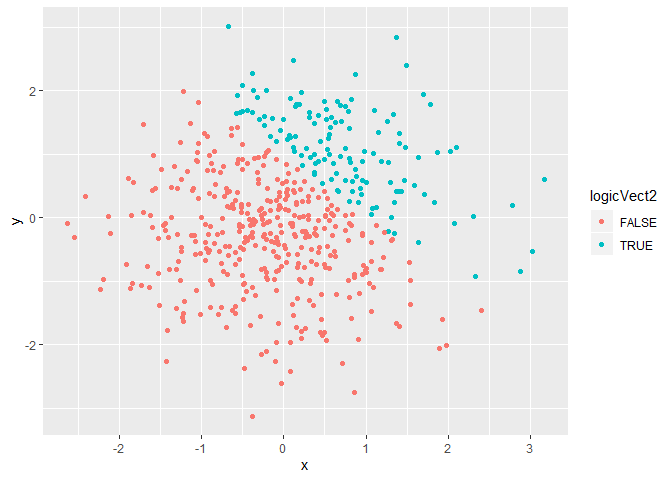
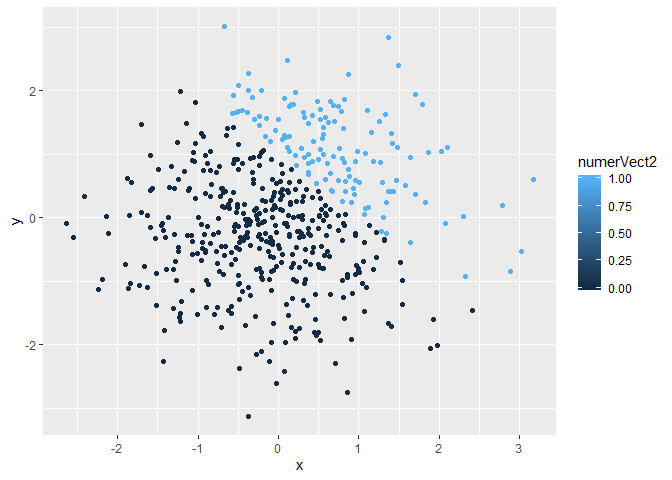
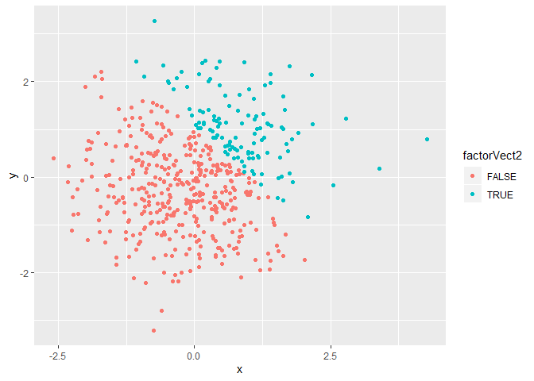

p8105\_hw1\_are2132
================
Alison Elgass

# Problem 1

First we create a dataframe `df1` with 4 vectors, each of size 8  
Each vector utilizes a different variable type

``` r
library(tidyverse)
```

    ## -- Attaching packages ----------------------- tidyverse 1.2.1 --

    ## v ggplot2 3.2.1     v purrr   0.3.2
    ## v tibble  2.1.3     v dplyr   0.8.3
    ## v tidyr   0.8.3     v stringr 1.4.0
    ## v readr   1.3.1     v forcats 0.4.0

    ## -- Conflicts -------------------------- tidyverse_conflicts() --
    ## x dplyr::filter() masks stats::filter()
    ## x dplyr::lag()    masks stats::lag()

``` r
df1 = tibble(
  normSamp = rnorm(8),                      #normal sample
  logicVect1 = normSamp > 0,                #logical
  charVect1 = character(length = 8),        #character
  factorVect1 = factor(c(1,2,3,1,2,3,1,2))  #factor
)
```

## Changing types

Next we use the as.numeric() function to convert vectors

``` r
a = as.numeric(pull(df1,logicVect1))
b = as.numeric(pull(df1,charVect1))
c = as.numeric(pull(df1,factorVect1))
```

This exercise shows that the logical and factor vectors can be converted
into numerical vectors (a and c) from which we can take their mean, but
the character vector cannot (vector b shows just 8 ’NA’s)

## Some multiplication

Now we convert the logical vector 3 ways, then multiply by our random
sample

``` r
as.numeric(pull(df1,logicVect1))*pull(df1,normSamp)
```

    ## [1] 1.1370943 1.2151050 0.1829258 0.0000000 1.1426687 0.1193249 0.0000000
    ## [8] 0.0000000

``` r
as.factor(pull(df1,logicVect1))*pull(df1,normSamp)
```

    ## Warning in Ops.factor(as.factor(pull(df1, logicVect1)), pull(df1,
    ## normSamp)): '*' not meaningful for factors

    ## [1] NA NA NA NA NA NA NA NA

``` r
as.numeric(as.factor(pull(df1,logicVect1)))*pull(df1,normSamp)
```

    ## [1]  2.2741886  2.4302099  0.3658516 -0.9575281  2.2853373  0.2386497
    ## [7] -0.7611630 -1.0093816

Again, we see that in the middle example above we cannot get a
reasonable numerical output since we are attempting to multiply a
numeric by a factor

# Problem 2

First we create a dataframe `df2` with 5 vectors

``` r
df2 = tibble(
  x = rnorm(500), #sample 500 from normal
  y = rnorm(500),
  logicVect2 = (x + y) > 1,
  numerVect2 = as.numeric(logicVect2),
  factorVect2 = as.factor(logicVect2)
)
```

In summary,  
The dataset `df2` has 500 rows and 5 columns  
The mean of `x` is -0.0308736  
The median of `x` is 0.0223355  
The standard deviation of `x` is 0.9855704  
The proportion of cases for which `x + y > 1` is 0.236

## Scatterplot 1

``` r
ggplot(df2, aes(x = x, y = y, color = logicVect2)) + geom_point()
```

<!-- -->

This scatterplot shows y vs. x from our dataframe `df2`  
The color of each point corresponds to the value of the logical vector
for the (x,y) pair. The point is

  - Blue if `(x+y) > 1` or `logicVect2 = TRUE`  
  - Red if `(x+y) <= 1` or `logicVect2 = FALSE`

We’ll also save this plot to the R project as a
jpeg

``` r
plot1 = ggplot(df2, aes(x = x, y = y, color = numerVect2)) + geom_point()
ggsave("scatter_plot.jpeg", plot1)
```

    ## Saving 7 x 5 in image

## Scatterplot 2

``` r
ggplot(df2, aes(x = x, y = y, color = numerVect2)) + geom_point()
```

<!-- -->

In this plot, each point is

  - Blue if `(x+y) > 1` or `numerVect2 = 1`  
  - Red if `(x+y) <= 1` or `numerVect2 = 0`

## Scatterplot 3

``` r
ggplot(df2, aes(x = x, y = y, color = factorVect2)) + geom_point()
```

<!-- -->

In this plot, each point is

  - Blue if `(x+y) > 1` or `factorVect2 = TRUE`  
  - Red if `(x+y) <= 1` or `factorVect2 = FALSE`
